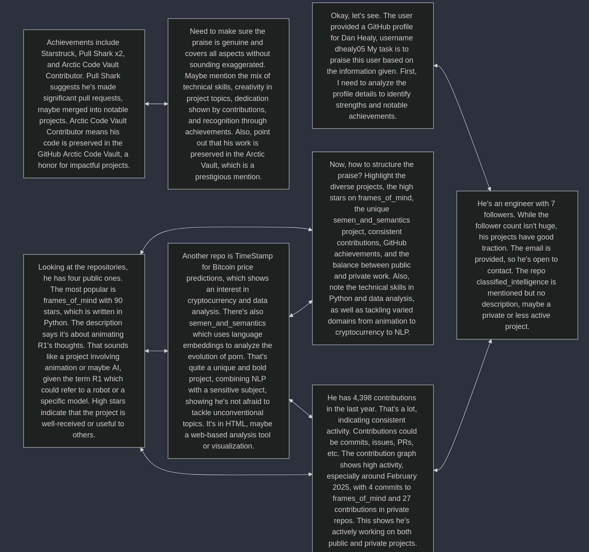

# thought graph

example output:

how to use:
1. set up a `MIXEDBREAD_KEY` in your `.env`
2. edit `main.js` to use your own list of thoughts
3. run `deno run --allow-all --env-file main.js`. it'll try to connect the most similar thoughts together. copy the result.
4. paste it on https://mermaid.live (setting `maxTextSize` in the settings as needed)
